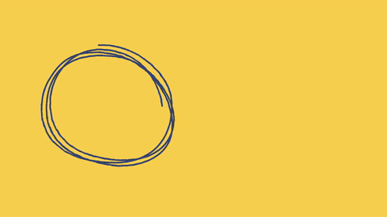

  

  

  <samp>
    <h2 align="center">😎 you can reach me by:</h2>
    

       
      
      
    

  

      
      
       
    

  </samp>

  

    <h2 align="center">🛠️ Languages and Tools</h2>
    

                                

    

  
🧮 about

<h2 align="center">🧮 About Me</h2>
    
👨🏽‍💻 I’m a graduate of <bold>Comsats University Islamabad</bold> working as a Junior software engineer @Devaxl

    
🌱 I’m currently working as a Full stack developer mainly in MERN stack along with a little twist of next, angular, react native, and python. I am also working on adding additional skills as a <bold>Devops</bold> to my portfolio.

    
🤔 My interest lies in <em>discovering and learning newest technologies.</em>

    
💬 I live by the motto <bold><em>Trait of all master of one</em></bold>

    
📫 Email me at <em><bold>awan.moeed@hotmail.com</bold></em>

  

    <h2 align="center"> 📊 Github stats </h2>
       
        

          
        

        

          
       

      
  

  <h2 align="center"> my current activity </h2>

---

Credit: [1999azzar](https://github.com/1999azzar)
Last Edited on: 01/06/2022
